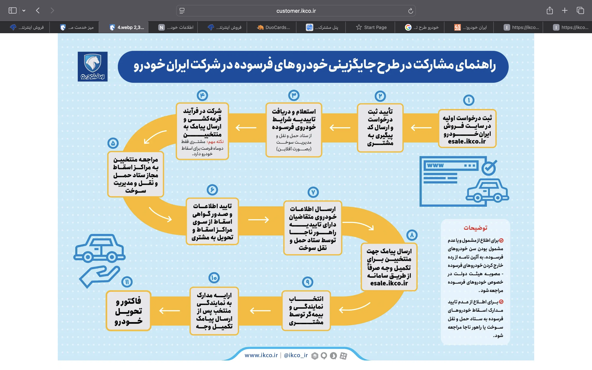

### Project Overview
- Developed machine learning models for MS lesion detection
- Implemented image segmentation algorithms
- Achieved 95% accuracy in lesion classification
- Collaborated with medical professionals for validation

### Technologies Used
- Python, TensorFlow, OpenCV
- Medical imaging (MRI) processing
- Deep learning and computer vision
- Clinical data analysis

